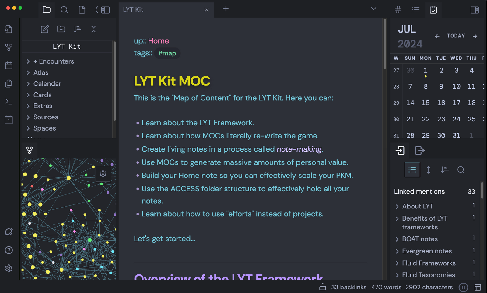

# Paper Brain



<figure><figcaption></figcaption></figure>

PaperBrain is a website that allows you to search for research papers on any topic or idea. You can enter a keyword, a title, or a question, and PaperBrain will show you relevant papers from various sources, such as arXiv, PubMed, Semantic Scholar, and more. You can also upload your own paper or document and PaperBrain will analyze it for you.

One of the main advantages of PaperBrain is that it provides you with abstracts and summaries of each paper, so you can quickly get an overview of the main points and findings. You can also access the full PDF of the paper with one click, without having to deal with annoying pop-ups or downloads.

But that's not all. PaperBrain also has a built-in GPT assistant that can help you understand the paper better. GPT is a powerful AI model that can generate natural language texts based on your input. You can ask the GPT assistant any question about the paper, such as what is the research question, what is the methodology, what are the results, what are the limitations, etc. The GPT assistant will try to answer your question in a simple and clear way, using information from the paper or from other sources.

The GPT assistant can also help you with other tasks related to your study, such as writing an outline, a summary, a critique, or a citation for the paper. You can also ask the GPT assistant to generate some questions for you to test your comprehension or to prepare for an exam or a presentation.

PaperBrain is a useful tool for anyone who wants to learn more about research papers and improve their academic skills. It can save you time and effort by providing you with easy access and understanding of research papers. It can also inspire you and spark your curiosity by showing you new and interesting papers on your topic of interest.

