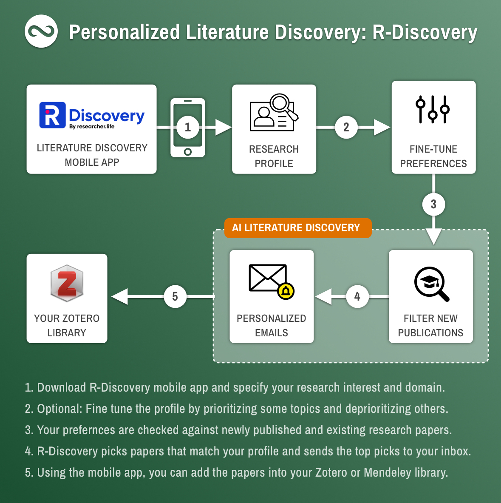

# R Discovery



R Discovery is a research reading platform that uses artificial intelligence to help researchers find, understand, and stay up-to-date on the latest research. It is a product of Researcher.Life, a company that provides AI-powered tools for researchers.

R Discovery has a number of features that make it a valuable resource for researchers, including:

* **Research paper search:** R Discovery can help you find relevant research papers by matching your research question or the abstract of a paper to its database of over 115 million open access papers and patents.
* **Research paper summarization:** R Discovery can provide summaries of research papers, making them easier to understand.
* **Research paper visualization:** R Discovery can visualize research papers, making it easier to see the relationships between different concepts.
* **Research paper recommendations:** R Discovery can recommend research papers that are related to your interests.
* **Research paper alerts:** R Discovery can send you alerts when new research papers are published that match your interests.
* **Personalized reading feed:** R Discovery creates a personalized reading feed for each user based on their interests and research activity.
* **Collaborative research:** R Discovery allows users to collaborate on research projects by sharing research papers, notes, and annotations.
* **Research workflow management:** R Discovery helps users manage their research workflow by providing tools for organizing research papers, setting deadlines, and tracking progress.

R Discovery is a powerful tool for researchers of all levels. It can help you find relevant research papers, understand them more easily, and stay up-to-date on your research field.

Additional details about R Discovery:

* It was created by a team of engineers and scientists at Researcher.Life.
* It uses a large language model to generate summaries and visualizations of research papers.
* The language model is trained on a massive dataset of research papers and patents.
* R Discovery is still under development, but it is already being used by thousands of researchers around the world.

<figure></figure>



