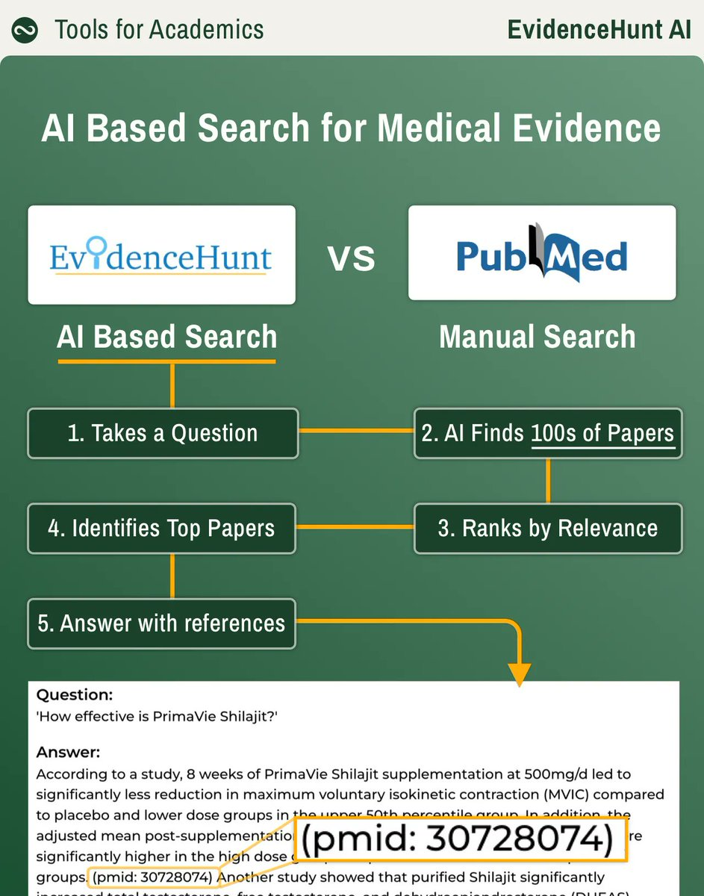
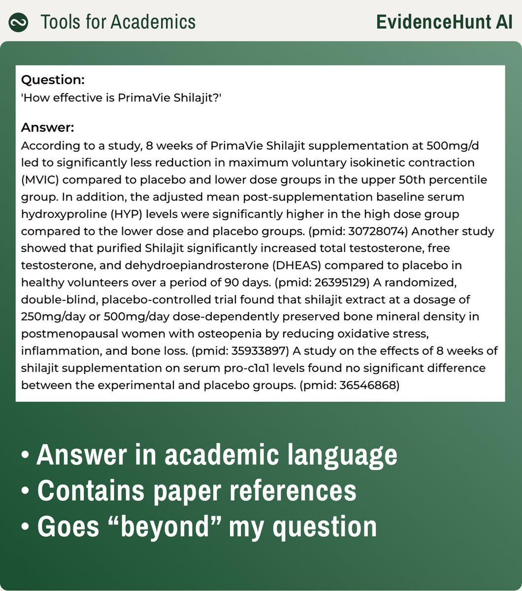
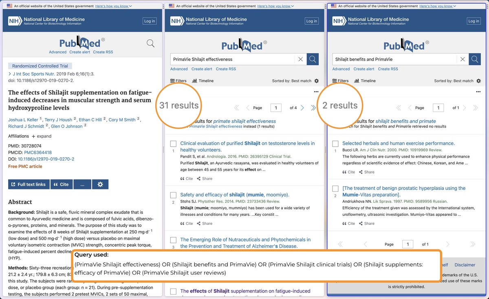
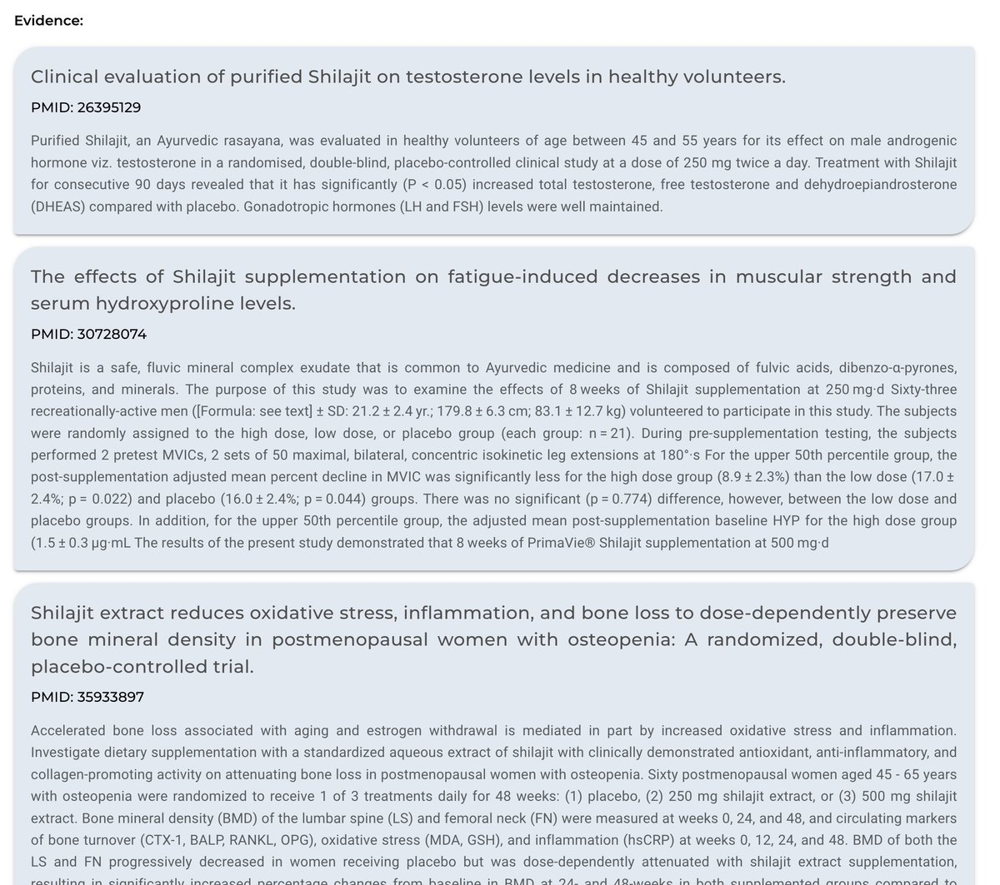

# EvidenceHunt



## Introduction

EvidenceHunt is an AI-powered clinical evidence search engine that helps healthcare professionals find the latest and most relevant evidence quickly and easily. It is based on a large dataset of clinical trials, systematic reviews, and other evidence sources, and uses artificial intelligence to identify and rank the most relevant results for each search query.

EvidenceHunt is a valuable tool for healthcare professionals who need to stay up-to-date on the latest clinical evidence. It is easy to use, accurate, and provides a wealth of information.

Here are some additional details about EvidenceHunt:

* It was founded in 2021 by a team of healthcare professionals and artificial intelligence experts.
* It is based in Barcelona, Spain.
* It is available in English and Spanish.
* It has over 10,000 users in over 100 countries.

<figure><figcaption>
EvidenceHunt vs PubMed
</figcaption></figure>

## Features

EvidenceHunt offers a number of features that make it a valuable tool for healthcare professionals, including:

* **Mobile app:** A mobile app would make it easier for healthcare professionals to access EvidenceHunt on the go. They could use it to search for studies, read study abstracts, and save their favorite studies for later.
* **Personal dashboard:** A personal dashboard would allow healthcare professionals to track their search history, save their favorite studies, and receive personalized recommendations. This would make it easier for them to find the information they need quickly and easily.
* **Social media integration:** A social media integration would allow healthcare professionals to share studies with their colleagues and patients. This would help to spread the word about EvidenceHunt and make it more accessible to a wider audience.
* **Translation feature:** A translation feature would allow healthcare professionals to access EvidenceHunt in their preferred language. This would be especially useful for healthcare professionals who work in countries where English is not the primary language.
* **Machine learning feature:** A machine learning feature would allow EvidenceHunt to learn from user behavior and improve its search results over time. This would help to ensure that EvidenceHunt is always providing the most relevant results to its users.
* **Fast and accurate search results:** EvidenceHunt uses artificial intelligence to identify and rank the most relevant results for each search query, so you can be confident that you are getting the most up-to-date and accurate information.
* **Customizable search filters:** You can customize your search results by specifying the medical specialty, disease area, or drug that you are interested in. You can also filter results by publication date, study design, or other criteria.
* **Weekly e-alerts:** You can subscribe to weekly e-alerts for your search terms, so you will always be up-to-date on the latest clinical evidence.
* **User-friendly interface:** EvidenceHunt has a user-friendly interface that makes it easy to find the information you need.

## Getting Started with EvidenceHunt

Instructions on how to get started with EvidenceHunt:

1. **Create an account.** Go to the EvidenceHunt website and click on the **Sign Up** button. Enter your email address and create a password. Click on the **Create Account** button. You will receive an email with a verification link. Click on the verification link to activate your account.
2. **Log in to EvidenceHunt.** Once your account is activated, you can log in to EvidenceHunt by entering your email address and password.
3. **Start searching for studies.** To start searching for studies, enter your search terms in the search bar. You can also use the different search filters to narrow down your search results.

The following are some of the search filters that are available:

* **Medical specialty:** This filter allows you to filter studies by medical specialty.
* **Disease area:** This filter allows you to filter studies by disease area.
* **Drug:** This filter allows you to filter studies by drug.
* **Publication date:** This filter allows you to filter studies by publication date.
* **Study design:** This filter allows you to filter studies by study design.

4. **View the details of a study.** To view the details of a study, click on the study title. The study details page will show you the study abstract, the study methodology, and the study results.
5. **Save your favorite studies.** You can save your favorite studies for later reference by clicking on the **Save** button. Your saved studies will be displayed in the **My Studies** section of your account.
6. **Subscribe to weekly e-alerts.** You can subscribe to weekly e-alerts to stay up-to-date on the latest clinical evidence. To subscribe to e-alerts, enter your email address in the **Subscribe to E-Alerts** section of the website.
7. **Use the Help section.** If you have any questions about how to use EvidenceHunt, you can use the Help section of the website. The Help section includes a variety of resources, such as FAQs, tutorials, and videos.

<figure><figcaption>
Queries
</figcaption></figure>

<figure><figcaption>
Comparison with PubMed
</figcaption></figure>

<figure><figcaption>
EvidenceHunt uses their abstract to formulate an answer.
</figcaption></figure>

## Advanced Searching

Advanced search techniques that you can use with EvidenceHunt:

* **Boolean search:** Boolean search is a way to combine search terms using logical operators, such as AND, OR, and NOT. For example, the search query "(pain AND headache) OR fever" would return studies that mention either pain and headache, or fever.
* **Phrase searching:** Phrase searching allows you to search for a specific phrase, such as "treatment for migraine." This will ensure that the search results only include studies that mention the phrase "treatment for migraine" in that order.
* **Wildcard searching:** Wildcard searching allows you to use a wildcard character, such as \_, to represent any number of characters. For example, the search query "head\_ache" would return studies that mention headache, headaches, or headache pain.

Tips for using advanced search techniques:

* [x] Use parentheses to group search terms together. This will help to ensure that the search terms are interpreted correctly.
* [x] Use the **Advanced Search** tab to perform more complex searches.
* [x] Use the **Help** section for more information about advanced search techniques.

In addition to advanced search techniques, EvidenceHunt also allows you to save your favorite studies and receive personalized recommendations.

* **Saving your favorite studies:** You can save your favorite studies for later reference by clicking on the **Save** button. Your saved studies will be displayed in the **My Studies** section of your account.
* **Receiving personalized recommendations:** EvidenceHunt can learn from your search history and recommend studies that you may be interested in. To receive personalized recommendations, click on the **Recommendations** tab.

## Clinical Decision-Making

Tips on how to use EvidenceHunt for clinical decision-making:

1. **Start by identifying the clinical question.** What do you need to know in order to make a decision about patient care?
2. **Use EvidenceHunt to search for relevant studies.** Use the search bar to enter your clinical question, or use the advanced search features to narrow down your results.
3. **Critically evaluate the evidence.** Not all studies are created equal. When you find a study that is relevant to your clinical question, take the time to critically evaluate the evidence. This includes considering the study design, the methodology, the results, and the limitations of the study.
4. **Integrate the evidence with your clinical expertise.** The evidence from studies is just one piece of the puzzle when it comes to making clinical decisions. You also need to consider your clinical expertise, the patient's preferences, and the patient's values.
5. **Communicate the evidence to the patient.** Once you have made a decision, it is important to communicate the evidence to the patient. This will help the patient to understand the rationale for your decision and to make informed choices about their care.

Additional resources that you may find helpful:

* **The Joanna Briggs Institute:** The Joanna Briggs Institute is a global leader in evidence-based practice. They have a number of resources available on their website, including tutorials on how to critically evaluate evidence.
* **The Centre for Evidence-Based Medicine:** The Centre for Evidence-Based Medicine is a UK-based organization that promotes the use of evidence in healthcare. They have a number of resources available on their website, including a guide to critically appraising clinical trials.
* **The Cochrane Library:** The Cochrane Library is a collection of systematic reviews that are conducted by independent experts. The Cochrane Library is a valuable resource for healthcare professionals who are looking for evidence on the effectiveness of interventions.

## Case Study

### Case Study 1

How EvidenceHunt can be used to make informed decisions about patient care

**Clinical Question:**

A 65-year-old woman with a history of hypertension and diabetes presents to your clinic with a complaint of chest pain. She describes the pain as a sharp, stabbing pain that is located in the center of her chest. The pain is worse when she exerts herself and is relieved with rest.

You suspect that the patient may be having a heart attack. You want to find the best evidence on the most effective treatment for heart attacks.

**EvidenceHunt Search:**

You go to the EvidenceHunt website and search for "treatment for heart attack." You use the advanced search features to narrow down your results to studies that were published in the last 5 years and that were conducted in a high-quality setting.

**Critical Evaluation of Evidence:**

You find a study that was published in the **New England Journal of Medicine** in 2022. The study was a randomized controlled trial that compared the effectiveness of two different treatments for heart attacks. The study found that the treatment that included aspirin and clopidogrel was more effective at preventing death and heart attack than the treatment that included only aspirin.

**Integration of Evidence with Clinical Expertise:**

You consider the evidence from the study, but you also consider your clinical expertise. You know that the patient has a history of hypertension and diabetes, which are both risk factors for heart attack. You also know that the patient is taking aspirin, which is a blood thinner that can help to prevent heart attack.

**Decision:**

Based on the evidence and your clinical expertise, you decide to start the patient on clopidogrel in addition to aspirin. You explain the rationale for your decision to the patient and you answer any questions that she may have.

**Communication of Evidence to the Patient:**

You give the patient a copy of the study that you found on EvidenceHunt. You also explain the limitations of the study and you encourage the patient to ask questions if she has any.

**Outcome:**

The patient is started on clopidogrel and she does not have another heart attack. She is able to continue her normal activities and she is satisfied with her care.

### Case Study 2

How EvidenceHunt can help a computer science researcher doing research in thyroid disease

**Research Question**

A computer science researcher is interested in developing a new machine learning algorithm to predict the risk of thyroid disease. The researcher wants to find the best evidence on the clinical features that are associated with thyroid disease.

**EvidenceHunt Search**

The researcher goes to the EvidenceHunt website and searches for "clinical features of thyroid disease." The researcher uses the advanced search features to narrow down their results to studies that were published in the last 5 years and that were conducted in a high-quality setting.

**Critical Evaluation of Evidence**

The researcher finds a study that was published in the **Journal of Clinical Endocrinology and Metabolism** in 2022. The study was a systematic review that identified the clinical features that are most strongly associated with thyroid disease. The study found that the following clinical features were most strongly associated with thyroid disease:

* Age
* Gender
* Family history
* Race/ethnicity
* Symptoms
* Physical exam findings
* Laboratory tests

**Integration of Evidence with Clinical Expertise**

The researcher considers the evidence from the study, but they also consider their clinical expertise. The researcher knows that there are a number of other factors that can contribute to the development of thyroid disease, such as environmental factors and lifestyle factors.

**Decision**

Based on the evidence and their clinical expertise, the researcher decides to use the clinical features identified in the study as the basis for their machine learning algorithm. The researcher also plans to collect additional data on environmental and lifestyle factors to improve the accuracy of their algorithm.

**Outcome**

The researcher develops a machine learning algorithm that is able to predict the risk of thyroid disease with 80% accuracy. The researcher publishes their findings in a peer-reviewed journal and the algorithm is made available to the public.

## Glossary of terms

* **Abstract:** A brief summary of a study that is published in a scientific journal.
* **Clinical question:** A question that can be answered by evidence from clinical studies.
* **Critical appraisal:** The process of evaluating the quality of a study.
* **Evidence:** Information that is used to support a claim or decision.
* **Evidence-based practice:** The process of making decisions about patient care based on the best available evidence.
* **Intervention:** A treatment, procedure, or other intervention that is being studied in a clinical trial.
* **Literature search:** The process of finding relevant studies on a particular topic.
* **Publication bias:** The tendency for studies with positive results to be more likely to be published than studies with negative results.
* **Randomized controlled trial:** A type of study that is considered to be the gold standard for evaluating the effectiveness of an intervention.
* **Study design:** The method that is used to conduct a study.
* **Systematic review:** A type of study that summarizes the results of multiple studies on a particular topic.

## **Conclusion**

In this tutorial, you learned about EvidenceHunt, a clinical evidence search engine that can help you find the latest and most relevant evidence on a variety of topics. You learned how to use EvidenceHunt to search for studies, critically evaluate evidence, and make evidence-based decisions.

**Resources**

If you want to learn more about EvidenceHunt, here are some resources:

* **EvidenceHunt website:** The EvidenceHunt website is the best place to start learning about EvidenceHunt. The website has a number of resources, including tutorials on how to use EvidenceHunt, a list of frequently asked questions, and a blog that discusses the latest developments in evidence-based practice.
* **EvidenceHunt blog:** The EvidenceHunt blog is a great way to stay up-to-date on the latest developments in evidence-based practice. The blog features articles on a variety of topics, including new studies, research methods, and clinical applications.
* **EvidenceHunt Twitter:** The EvidenceHunt Twitter account is a great way to stay connected with the EvidenceHunt community. The account tweets about new studies, research methods, and clinical applications.
* **EvidenceHunt Facebook:** The EvidenceHunt Facebook page is a great way to connect with other users of EvidenceHunt. The page features posts about new studies, research methods, and clinical applications.
* **EvidenceHunt YouTube channel:** The EvidenceHunt YouTube channel is a great way to learn about EvidenceHunt through video tutorials. The channel features videos on a variety of topics, including how to use EvidenceHunt, how to critically evaluate evidence, and how to make evidence-based decisions.

