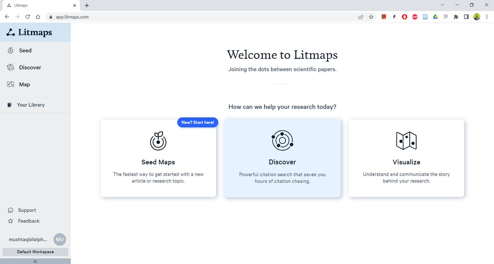
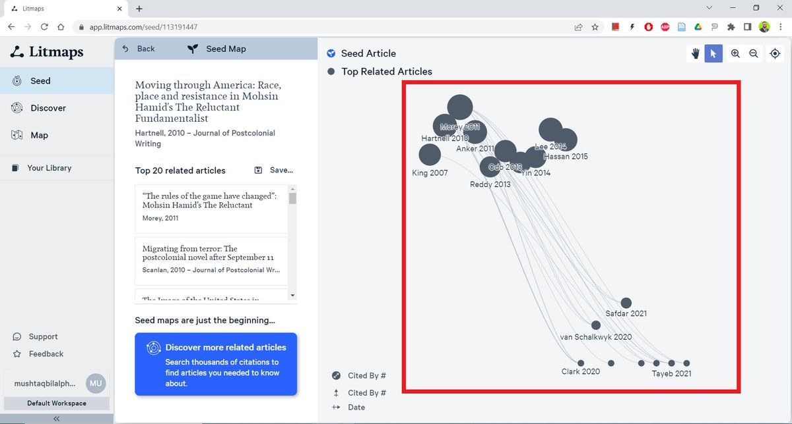
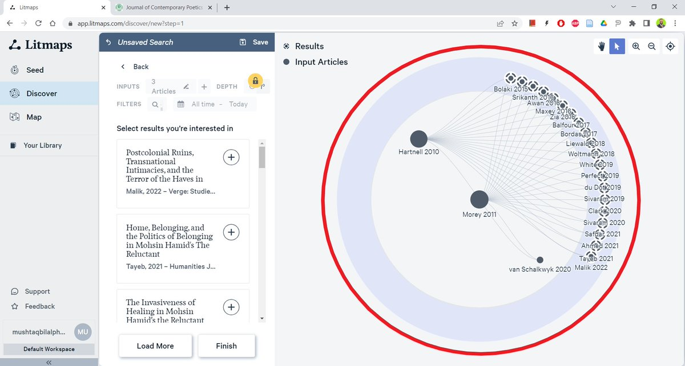

# Litmaps

🔗 **Website:** [Litmaps](https://www.litmaps.com/)

## Introduction

Litmaps is a tool that uses natural language processing and machine learning to help users visualize the relationships between different papers. It can be used to identify gaps in the literature, to find new papers that are relevant to a research topic, and to collaborate with others.

Litmaps works by analyzing the text of papers and identifying the relationships between them. It does this by looking for common words, phrases, and concepts. Once the relationships between papers have been identified, Litmaps can create visualizations of these relationships.


Introduction to Litmaps


These visualizations can be helpful for identifying gaps in the literature. For example, if you are researching a topic and you see that there are no papers that connect two different concepts, you know that there is a gap in the literature that you could fill.

Litmaps can also be helpful for finding new papers that are relevant to your research topic. By visualizing the relationships between papers, you can see which papers are related to each other. This can help you to identify papers that you may not have found otherwise.

Litmaps can be used to collaborate with others. You can share your visualizations with others and discuss your research. This can help you to get feedback on your research and to learn from others.

<figure><figcaption></figcaption></figure>

## **Benefits of using Litmaps?**

Litmaps can help users to visualize the relationships between different papers, which can make Litmaps is a literature mapping tool that can help researchers find, organize, and visualize their research literature. Here are some of the benefits of using Litmaps:

* **Find relevant papers:** Litmaps can help you find relevant papers by using the citation network. This means that Litmaps can find papers that are related to your research topic, even if they don't use the same keywords.
* **Organize your literature:** Litmaps can help you organize your literature by creating interactive maps. These maps can help you to visualize the relationships between different papers and to identify gaps in your research.
* **Prioritize your reading list:** Litmaps can help you prioritize your reading list by ranking your papers in order of importance. This can help you to focus on the most important papers and to avoid getting bogged down in irrelevant papers.
* **Share your research:** Litmaps can help you to share your research with others. You can export your maps to PDF or share them directly through Litmaps.
* **Stay up-to-date:** Litmaps can help you to stay up-to-date on your research topic by monitoring new papers that are published. This can help you to ensure that you are always aware of the latest research in your field.

Litmaps is a powerful tool that can help researchers to find, organize, visualize, and share their research literature. If you are looking for a way to improve your research process, then I highly recommend using Litmaps.

Here are some additional benefits of using Litmaps:

* **It can help you to identify gaps in your research.** By visualizing the relationships between different papers, you can see where there are gaps in your knowledge. This can help you to focus your research on the most important areas.
* **It can help you to save time.** Litmaps can automate many of the tasks involved in literature review, such as finding relevant papers and organizing your citations. This can free up your time so that you can focus on more creative and strategic aspects of your research.
* **It can help you to collaborate with others.** You can share your Litmaps maps with colleagues and collaborators, which can help you to get feedback on your research and to build relationships with other researchers.

If you are looking for a way to improve your research process, then I highly recommend using Litmaps. It is a powerful tool that can help you to find, organize, visualize, and share your research literature.

## Getting started with Litmaps

To get started with Litmaps, you can either:

* **Search for a paper or author:** Enter a DOI, PubMed ID, arXiv ID, keyword, or author's name into the search bar to find related papers.
* **Import your reference manager:** If you use a reference manager like Zotero, Mendeley, or EndNote, you can import your library into Litmaps.
* **Create a seed map:** If you have a specific paper or research topic in mind, you can create a seed map by adding that paper to Litmaps. Litmaps will then use the citation network to find related papers.


Litmaps | AI for Researchers


Once you have created a Litmap, you can explore the connections between different papers, prioritize your reading list, and export your map to PDF.

Additional tips for getting started with Litmaps:

* **Use the search bar to find related papers:** The search bar is a great way to find papers that are related to your research topic. You can search by DOI, PubMed ID, arXiv ID, keyword, or author's name.
* **Import your reference manager:** If you use a reference manager, you can import your library into Litmaps. This will save you time from having to manually add papers to Litmaps.
* **Create a seed map:** If you have a specific paper or research topic in mind, you can create a seed map by adding that paper to Litmaps. Litmaps will then use the citation network to find related papers.
* **Explore the connections between different papers:** Once you have created a Litmap, you can explore the connections between different papers. This can help you to understand the relationships between different papers and to identify gaps in your research.
* **Prioritize your reading list:** Litmaps can help you to prioritize your reading list. You can use the "Prioritize" button to rank your papers in order of importance.
* **Export your map to PDF:** Once you have finished with your Litmap, you can export it to PDF. This will allow you to share your map with others or to print it out.

<figure><figcaption></figcaption></figure>

 

<figure><figcaption></figcaption></figure>

Litmaps has a number of advanced features that can help you to get the most out of your research. Here are a few of the most notable advanced features:

* **Explore:** The Explore feature allows you to find related papers to add to your map. You can combine keywords, papers from existing maps, and filters like publication date to find new articles that are "most highly connected" to your existing map.
* **Visualizations:** Litmaps offers a variety of visualizations that can help you to understand the relationships between different papers. You can choose to visualize your map by publication date, citation count, or title similarity.
* **Notes:** You can add notes to your maps to annotate your research and to keep track of your thoughts. Notes can be private or shared with others.
* **Collaboration:** You can collaborate with others on Litmaps maps. This can be a great way to get feedback on your research and to build relationships with other researchers.
* **Export:** You can export your maps to PDF or to other formats. This allows you to share your maps with others or to print them out.

## Advanced features

Additional advanced features of Litmaps:

* **The ability to filter your searches by author, date, and keyword.** This allows you to narrow down your search results and to find the most relevant papers.
* **The ability to create groupings or subsets of articles in different colours to help tell your research story.** This can help you to visualize the different aspects of your research and to identify patterns.
* **The ability to monitor new papers that are published in your field.** This can help you to stay up-to-date on the latest research and to identify new papers that are relevant to your research topic.

## Case Study

### **Case Study 1**

A PhD student in computer science used Litmaps to create a map of the literature on machine learning. The student was interested in the intersection of machine learning and natural language processing, and they wanted to see how the two fields were converging.

The student started by creating a map of the literature on machine learning. They used the Litmaps search bar to find papers that were related to machine learning, and they used the "Explore" feature to find related papers. The student also imported their reference manager into Litmaps, which allowed them to easily add papers to their map.

Once the student had created a map of the literature on machine learning, they started to explore the connections between different papers. They were surprised to see how many papers were related to both machine learning and natural language processing. This helped the student to identify new research opportunities, and it also helped them to understand the different aspects of machine learning and natural language processing.

### **Case Study 2**

A research team in medicine used Litmaps to create a map of the literature on cancer research. The team was interested in identifying new research trends in cancer research, and they wanted to see how different research groups were collaborating.

The team started by creating a map of the literature on cancer research. They used the Litmaps search bar to find papers that were related to cancer research, and they used the "Explore" feature to find related papers. The team also imported their reference manager into Litmaps, which allowed them to easily add papers to their map.

Once the team had created a map of the literature on cancer research, they started to explore the connections between different papers. They were surprised to see how many research groups were working on the same cancer research projects. This helped the team to identify new research opportunities, and it also helped them to collaborate with other research groups.

## **Video**

<table><thead><tr><th width="71.33333333333331" align="center">No</th><th width="491">Title</th><th align="center">File</th></tr></thead><tbody><tr><td align="center">1</td><td>Import your reference manager into Litmaps</td><td align="center"></td></tr><tr><td align="center">2</td><td>Prioritize your reading list using Litmaps</td><td align="center"></td></tr><tr><td align="center">3</td><td>Advanced Search Features</td><td align="center"></td></tr><tr><td align="center">4</td><td>How to quickly visualize a collection of articles</td><td align="center"></td></tr><tr><td align="center">5</td><td>How to explore a particular area of research</td><td align="center"></td></tr><tr><td align="center">6</td><td>How to accelerate your literature review with Litmaps</td><td align="center"></td></tr><tr><td align="center">7</td><td>The fastest way to do your literature review [Do it in SECONDS]</td><td align="center"></td></tr></tbody></table>

## **Conclusion**

Litmaps is a powerful tool that can help researchers to find, organize, visualize, and share their research literature. It can be used to identify gaps in the literature, to find new papers that are relevant to a research topic, and to collaborate with others. The advanced features of Litmaps can help you to get the most out of your research and to improve your research process.

&#x20;
