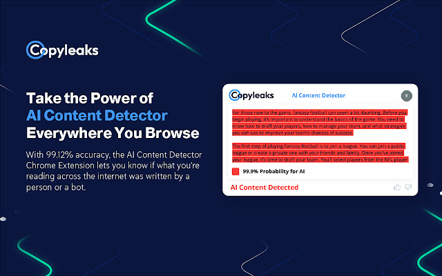
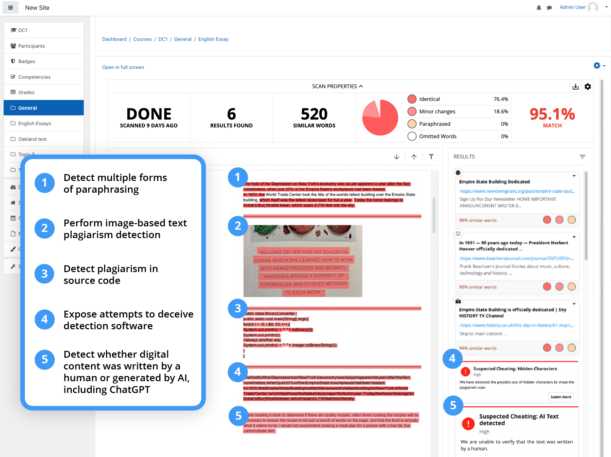

# Copyleaks

## Overview

Verify what content was written by a human or an AI chatbot with the AI Content Detector Chrome extension from Copyleaks.

With the Copyleaks AI Content Detector, you can quickly and accurately determine what was written by a human and what was created by an AI, including GPT-4 and Bard, even if the AI text was paraphrased or interspersed with human-written content.

Browse with confidence and verify the authenticity of posts on social media, news articles, and even reviews on your favorite shopping sites. The possibilities are endless.

<figure><figcaption></figcaption></figure>

### AI Content Detector Key Features

⭐ Unprecedented 99.1% accuracy and a 0.2% false positive rate, the lowest of any platform.

⭐ Detects ChatGPT (including GPT-4), Bard, T5, Jasper, and more.

⭐ Detects AI content over ten languages, including English, Spanish, and a dozen other languages, with additional languages currently in the works

⭐ Recognized by CNET, VentureBeat, Wall Street Journal, Search Engine Journal, Vanity Fair, and dozens of other leading publications

⭐ The most installs of any AI content detector and a five-star rating!

<figure><figcaption></figcaption></figure>

### Installation&#x20;

Simply follow these steps:

✅ Click ‘Add to Chrome’.&#x20;

✅ Click on the extensions icon, and pin the AI Content Detector Extension to the extensions bar.&#x20;

✅ Login via Google or Facebook.&#x20;

✅ Start using the AI Content Detector Extension anywhere your internet browsing may take you by highlighting the text you want to verify and then clicking the extension icon.

## Recent new features include

⭐ The ability to detect GPT-4 and Bard&#x20;

⭐ Detection of paraphrased AI text, making Copyleaks the only platform capable of detecting paraphrased AI content.&#x20;

⭐ A newly integrated confidence rating adds another layer of transparency.&#x20;

⭐ Across the board accuracy improvements.
