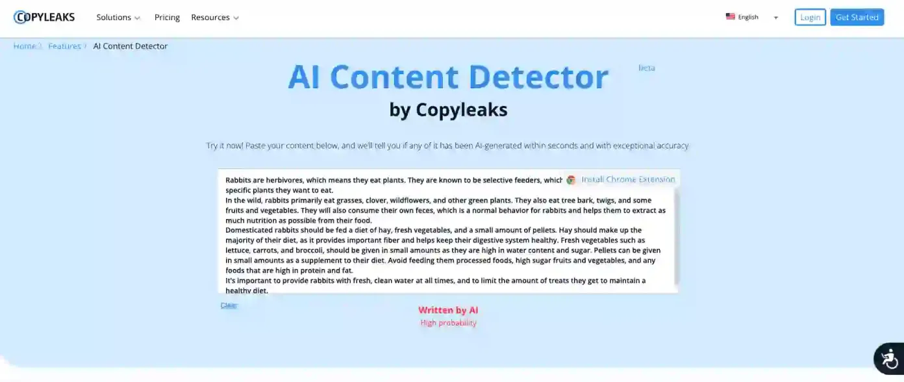

# Copyleaks



## Overview

Verify what content was written by a human or an AI chatbot with the AI Content Detector Chrome extension from Copyleaks.

With the Copyleaks AI Content Detector, you can quickly and accurately determine what was written by a human and what was created by an AI, including GPT-4 and Bard, even if the AI text was paraphrased or interspersed with human-written content.

Browse with confidence and verify the authenticity of posts on social media, news articles, and even reviews on your favorite shopping sites. The possibilities are endless.

<figure><figcaption></figcaption></figure>

## AI Content Detector Key Features

Copyleaks boasts a remarkable 99.12% accuracy rate in identifying whether content has been created by humans or AI using its AI-powered plagiarism detector. The tool also supports multiple languages, including French, Spanish, German, and more.

Copyleaks adopts a “fight fire with fire” approach, utilizing AI to detect AI-generated text. This allows the tool to evolve and remain effective against the newest AI chatbots, making it a highly capable tool. Copyleaks has even pledged support for ChatGPT 4 when it becomes available.

You can utilize this AI plagiarism checker in a variety of scenarios, including articles, reviews, posts, and academic papers. To test it out, I copied text from an old GeeksGyaan article on smartphone addiction.

In under 10 seconds, the AI text detection tool analyzed over 600 words and gave me the green light, indicating the text was human-written. I repeated the test with several text excerpts and the tool consistently delivered accurate results.

⭐ Unprecedented 99.12% accuracy and a 0.2% false positive rate, the lowest of any platform.

⭐ Detects ChatGPT (including GPT-4), Bard, T5, Jasper, and more.

⭐ Detects AI content over ten languages, including English, Spanish, and a dozen other languages, with additional languages currently in the works

⭐ Recognized by CNET, VentureBeat, Wall Street Journal, Search Engine Journal, Vanity Fair, and dozens of other leading publications

⭐ The most installs of any AI content detector and a five-star rating!

<figure><figcaption></figcaption></figure>

### Installation

Simply follow these steps:

✅ Click ‘Add to Chrome’.

✅ Click on the extensions icon, and pin the AI Content Detector Extension to the extensions bar.

✅ Login via Google or Facebook.

✅ Start using the AI Content Detector Extension anywhere your internet browsing may take you by highlighting the text you want to verify and then clicking the extension icon.

## Recent new features include

⭐ The ability to detect GPT-4 and Bard

⭐ Detection of paraphrased AI text, making Copyleaks the only platform capable of detecting paraphrased AI content.

⭐ A newly integrated confidence rating adds another layer of transparency.

⭐ Across the board accuracy improvements.

