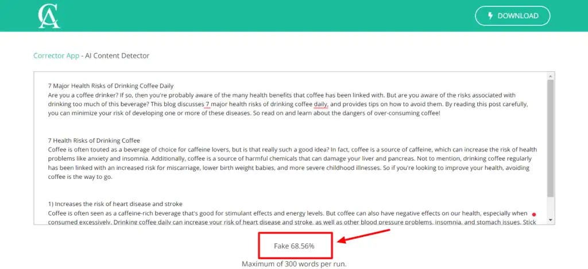

# Corrector.app



Corrector.app is a web-based platform that helps users improve their writing by detecting and correcting grammar and spelling mistakes. It is designed to be easy to use and can be accessed from any device with an internet connection.

<figure><figcaption></figcaption></figure>

Corrector.app uses a variety of techniques to detect and correct errors, including:

* **A grammar checker:** The grammar checker identifies and corrects grammatical errors in the user's writing.
* **A spelling checker:** The spelling checker identifies and corrects spelling errors in the user's writing.
* **A style checker:** The style checker provides suggestions for improving the style of the user's writing.
* **A plagiarism checker:** The plagiarism checker identifies and reports any instances of plagiarism in the user's writing.

Corrector.app is a free service, but it offers a premium plan that provides additional features, such as:

* **The ability to check more documents per month.**
* **The ability to get feedback from a human editor.**
* **The ability to use the service offline.**

Benefits of using Corrector.app:

* **It is easy to use:** Corrector.app is a web-based platform that can be accessed from any device with an internet connection. This makes it easy to use, regardless of your location or device.
* **It is accurate:** Corrector.app uses a variety of techniques to detect and correct errors, including a grammar checker, a spelling checker, and a style checker. This ensures that your writing is accurate and error-free.
* **It is affordable:** Corrector.app is a free service, but it offers a premium plan that provides additional features. This makes it an affordable option for both personal and professional use.

