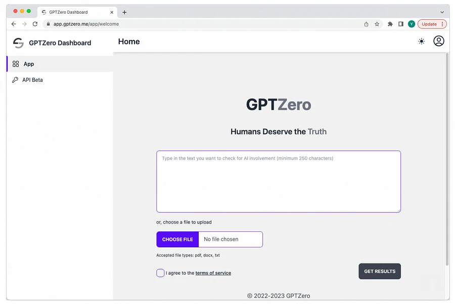

# GPTZero



GPT (Generative Pre-trained Transformer) is a popular class of language models developed by OpenAI that has revolutionized natural language processing tasks such as language translation, question answering, and text completion. GPT models are trained on large datasets of text to generate human-like responses to various prompts, making them useful for a wide range of applications.

However, concerns have been raised about the potential misuse of these models for generating fake news, spam, and other undesirable content. To address this issue, OpenAI has proposed a hypothetical version of their GPT model called [GPTzero](https://gptzero.me/), which has zero pre-existing parameters or weights, making it a blank slate that can be trained from scratch.

<figure><figcaption></figcaption></figure>

## What is GPTZero?

[GPTZero](https://gptzero.me/) is an AI text analyzer tool developed by Edward Tian, a computer science graduate, to help instructors distinguish plagiarized text from original work. The tool checks perplexity and burstiness in a text to determine whether it is artificially generated or crafted by a human.


```
GPTZero is a classification model that predicts whether a document was written by a large language model, providing predictions on a sentence, paragraph, and document level. GPTZero was trained on a large, diverse corpus of human-written and AI-generated text, with a focus on English prose.
```


## Does GPTZero only detect ChatGPT outputs? <a href="#only-chatgpt-generations" id="only-chatgpt-generations"></a>

GPTZero works robustly across a range of AI language models, including but not limited to ChatGPT, GPT-3, GPT-2, LLaMA, and AI services based on those models.

## How GPTZero Works?


GPTZero is an AI tool that can help identify the use of AI in generating text. It provides a document-level score that shows the probability the entire document was AI-generated. This score can be used to determine whether or not there is significant use of AI in the text.

In cases where there is a mix of AI-generated and human-written content, sentence-level classification can be used.

If a single sentence is highlighted as AI-generated, it should not be taken as an indication that the entire document is partially AI-generated. Instead, when a large portion of the text is identified as AI-generated, the highlighted sentence indicates where in the text this occurred.

The goal of the classifier is to flag situations where further inquiry and awareness of the risks of using AI in written work are needed.

It can be useful in education, certification, hiring and recruitment, social writing platforms, and situations where plagiarism or disinformation may be a concern.

## The Role of GPTzero in Detecting ChatGPT-Generated Research Articles

ChatGPT is a large language model developed by OpenAI that can generate coherent and informative research articles on a wide range of topics.

However, it has been observed that some of the articles generated by ChatGPT contain plagiarized content, which can be problematic for researchers and academics. To address this issue, OpenAI has developed GPTzero, a detector model that can identify research articles generated by ChatGPT that contain plagiarized content.

## How GPTzero Works

GPTzero works by comparing the text generated by ChatGPT with a large dataset of known research articles to identify similarities and overlaps. This is done using a variety of techniques, including text similarity metrics, semantic analysis, and machine learning algorithms. If GPTzero identifies significant similarities between a ChatGPT-generated research article and a known research article, it flags the article for further review by human moderators. This allows researchers and academics to verify the originality and authenticity of the research article before citing or referencing it.

## Limitations and Future Developments of GPTzero

While GPTzero is a promising tool for detecting plagiarized content in ChatGPT-generated research articles, it is not perfect.

There are still some limitations to the accuracy of the detection algorithm, particularly when it comes to detecting paraphrasing and rewording of existing content. Additionally, as GPTzero is a relatively new technology, there is still much room for improvement and refinement in the future.

## Summary

GPTzero is a hypothetical version of OpenAI’s GPT model that has zero pre-existing parameters or weights. It has been developed specifically to detect ChatGPT-generated research articles that contain plagiarized content.

While there are still some limitations to the accuracy of the detection algorithm, GPTzero represents an important step forward in the fight against fake news, spam, and other undesirable content generated by AI language models.
