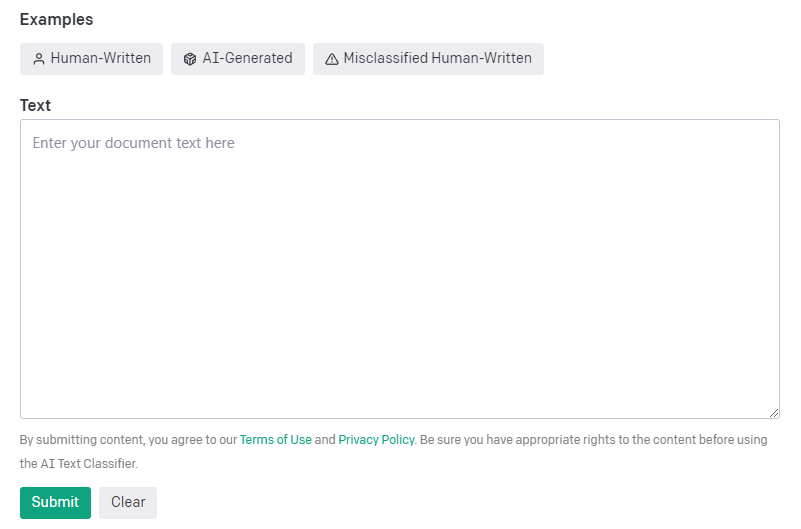

# Open AI Text Classifier



The AI Text Classifier is a free tool that predicts how likely it is that a piece of text was generated by AI. The classifier is a fine-tuned GPT model that requires a minimum of 1,000 characters, and is trained on English content written by adults. It is intended to spark discussions on AI literacy, and is not always accurate. Users can submit their text to the classifier to get a result that is either very unlikely, unlikely, unclear if it is, possibly, or likely AI-generated.

<figure><figcaption></figcaption></figure>
