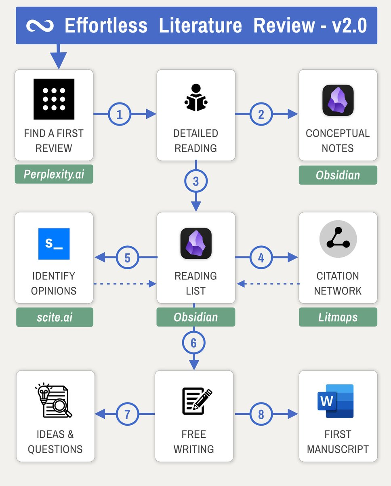

# The Effortless Literature Review

The Effortless Literature Review is based on the idea that the traditional literature review process is too time-consuming and inefficient. The workshop teaches you how to use a variety of tools and techniques to find, filter, and summarize research papers more quickly and easily.

<figure><figcaption></figcaption></figure>

Literature review does not need to be time consuming or confusing. Effortlessly find literature, use AI to screen for relevance and "3-step-filtering" to find the top 10% papers in your collection.

Let’s look at the steps:

<figure><figcaption></figcaption></figure>

This seems like many steps - but you probably know some of them already. The effortlessness comes from integrating them with one another and leveraging the synergy between them.

### 1. Finding “Seeds”


[google-scholar.md](../ai-tools/lit-search/google-scholar.md)


The old ways of finding papers is to “google” them, e.g. on Google Scholar or Arxiv.

If you search for “yeast” you may find papers on:

* Brewing science (yeast as a fermentation agent)
* Molecular biology (yeast as a model organism)
* Medical science (yeast as infection)
* Evolution (yeast by itself)

<figure><figcaption></figcaption></figure>

Google would usually rank higher cited papers at the top. Molecular biology and medicine are huge domains. So effectively you will find much less on evolution.

**Problem:** Finding all relevant literature in such cross-domain fields becomes challenging. Separating important from irrelevant is even harder.

Scite.ai (20$/mo) can help here by hinting at the _**importance**_ of individual papers. It can tell you how often a paper has been supported or contrasted.


[scite-ai.md](../ai-tools/lit-search/scite-ai.md)


Papers with supporting claims are not “just mentioned” but actually validated. So the connection in our publication network is stronger and thus indicated relevance.

Luckily you can use both - as scite integrates into google scholar.

<figure><figcaption></figcaption></figure>

[Scite.ai](https://scite.ai/) will also allow us to find where and how exactly a paper is mentioned (i.e. let us see the mentioning snippet). It is an amazing tool that integrates well with the rest of the academic tool eco system.

This combination of google scholar and scite.ai is a great way to find the first few papers. Their citations and references will give us access to all the other relevant papers (Step 3).

### 2. Analyze abstracts with AI


[arxivgpt.md](../ai-tools/chatbot/chatgpt/arxivgpt.md)


ArxivGPT is a Google Chrome extension that helps you quickly understand the content of arXiv papers. It uses a large language model, also known as a conversational AI or chatbot trained to be informative and comprehensive. ArxivGPT is trained on a massive dataset of arXiv papers, and it can summarize the content of a paper in a few sentences, highlighting the key ideas and concepts.

To use ArxivGPT, simply install the extension and open an arXiv paper in your browser. The extension will automatically detect the paper and generate a summary. You can also click on the extension icon to manually generate a summary.

ArxivGPT is a useful tool for researchers, students, and anyone who wants to stay informed about the latest developments in their field. It can save you time and help you quickly grasp the main ideas of a paper.

With a little bit of creativity you can use ArxivGPT not to summarize abstracts but to ask it to RATE them.

People are weary of using ChatGPT in science, because it creates fake citations, doesn’t know math and is [over confident](https://www.reddit.com/r/ChatGPT/comments/10jshk5/why\_is\_chat\_gpt\_confident\_in\_every\_answer/).


[chatgpt](../ai-tools/chatbot/chatgpt/)


But ChatGPT is good at one thing: Comparing text.

If you design your prompts to describe what you are looking for and then add the abstract of a paper the results will surprise you.

In this example I used a simple prompt and asked it to rate for relevance. And indeed the results are spot-on!

<figure><figcaption></figcaption></figure>

This allows me to screen papers for relevance. You can ask ANY question that could be answered from the abstract and without domain knowledge.

There are so many way this workflow can be used:

* Filter method papers, from theory papers
* Identify papers working with a specific model organism, algorithm or methodology
* Identify what the authors themselves see as potential limitations (discussion)
* Summarize in different formats (keywords, bullets, sentences)

### 3. Growing your collection

Once you have acquired a few seed papers, it is time to start exploring the citation network. Go through the list of _**references**_ at the end of your seed paper and you will find all the papers _**in the past**_.

The problem here is that you can only go back in time - not forward.

<figure><figcaption></figcaption></figure>

References are easy to find, but they only look into the past. We need _**citations**_ to find out how the field has developed since.

In the past you would look into the _**journal**_ of the publication and read a more recent issue. But citations can be scattered across many journals.

Today the journal method is outdated. There are tools to find everything much more easily and visually.

My all-time favourite tool for the job is [Litmaps](https://litmaps.com/). In [Gourmet Literature Review](https://ilyashabanov.substack.com/p/gourmet-literature-review) I described how we can use it, so I won’t go into too much detail here. But to give you an overview, this is how it looks:

<figure><figcaption></figcaption></figure>


[litmaps.md](../ai-tools/paper-discovery/litmaps.md)


**Seed maps** in Litmaps show us all publications related (references and citations) to a _**single**_ publication. They are an effortless way of discovery where we don’t have to drill through references lists.

**Discovery** in Litmaps shows us similar papers to a collection of papers we already have.

So each time we look at either of these we can add new papers and grow our collection.

### 4. Importance Filtering

After you have grown your collection in the previous step you will probably end up with 100s of papers. Impossible to read.

My method is to filter in 3 steps or cuts. Identify the:

* 10% most recent
* 10% most cited
* 10% reviews

Archive the rest of the papers for later (or never).

All of this is easy to do with Litmaps and Zotero. Luckily those two work together through an exchange format called BibTeX. I can import and export papers from one to another.

This workflow is also partially described in the [literature review article](https://ilyashabanov.substack.com/p/gourmet-literature-review). Since writing the article I added scite.ai to also look and sort for _**controversial**_ papers.

<figure><figcaption></figcaption></figure>

In the picture above you see that the Mori 2018 paper did receive the least citations of the 5. But it has more debate going on as there are many supporting claims as well as someone contrasting it.

This paper is therefore _**debated**_. (And indeed it is, this paper is about the link of biodiversity to ecological functions or eco system services. First of all we don’t know for sure where biodiversity comes from and second we only start to understand what services eco systems provide (i.e. air/water purification, climate regulation, flood protection) etc. Of course it is a subject of scrutiny! )

This integration allows us to identify _**ongoing debates**_ in the field. And this is where “science” happens. You can quickly learn arguments around your field with precisely these papers.

### 5. Reading and taking notes

Note taking is actually the more important skill when doing research. In my last article I wrote about [boosting creativity](https://ilyashabanov.substack.com/p/creativity-on-autopilot) and generating ideas on auto-pilot by using the right tools and methods.

**Problem**: We summarize what we read but we focus less on connecting them.

That is because our brain is a connecting system. So even by summarizing we get new ideas through the subconscious workings of the mind.

But our mind has limits. That means the number of ideas generally won’t scale indefinitely with the amount of information we consume. At some point you will start forgetting and this replaces older knowledge.

The right note taking system can help here. We can let our tools generate some of the connections we miss with our mind. Plus everything is stored forever.

<figure><figcaption>
This graph visualizes the idea
</figcaption></figure>

In gray are notes that summarize what I know (here: on proteins A,B,C,D…). While some of them are connected because I _**thought**_ of it, others are connected in two steps by the green and purple nodes. These are tags and maps of content respectively.

By tagging two notes with the same label I connect them, but without explicitly thinking of it.

This is the “auto-pilot” aspect of this method. We only think of tagging N notes. The number of possible connections between them is N \* (N - 1). For 100 notes this is 9900 connections - impossible to think of manually.

If you have used Zotero or another reference manager you have encountered these endless lists of papers with the only way to navigate being the search bar.

But you can only search for what you can recall i.e. title, author or tag of a paper you saved.

VRM allows you to lay out the papers _**visually**_ on a canvas and connect them in groups or individually.

<figure><figcaption></figcaption></figure>

The result is that you can now use your _**spatial memory**_ to remember your publications. Humans have evolved from animals that had to roam vast landscapes in search for food, naturally our spatial memory is quite well developed.

Concepts on the other hand are abstract and only a very recent evolutionary development. That’s why you can remember the neighbourhood of your childhood even decades later.

### Useful Links

1.  [Gourmet Literature Review](https://ilyashabanov.substack.com/p/gourmet-literature-review)
2.  [Adding AI to your Academic Workflow](https://ilyashabanov.substack.com/p/adding-ai-to-your-academic-workflow)
3.  [Spotting the Gap in the Literature](https://ilyashabanov.substack.com/p/spotting-the-gap-in-the-literature)
4.  [Academic Planning Masterclass](https://ilyashabanov.substack.com/p/academic-planning-masterclass)
5.  [From Reference Manager to Reference Maps](https://ilyashabanov.substack.com/p/from-reference-manager-to-reference)
6.  [Power User Initiation: Becoming 2x faster at writing and managing your notes](https://ilyashabanov.substack.com/p/power-user-initiation-becoming-2x)
7.  [Note Taking System For Success in Academia](https://ilyashabanov.substack.com/p/note-taking-system-for-success-in)

### Summary

Literature Review is central to any researcher and also the most time consuming part of science.

Tools and polished workflows can cut the time you spend on it. They can help you create an overview, identify debates and “hot topics”.
