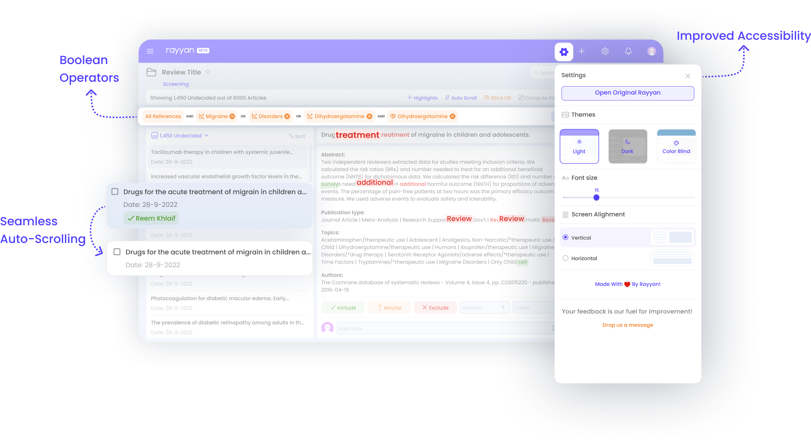

# Rayyan



Rayyan AI is an AI-powered tool that helps researchers find, screen, and analyze research papers. It was developed by the Qatar Computing Research Institute, funded by the Qatar Foundation, a nonprofit that supports education, science, research, and community development initiatives in Qatar.

Rayyan AI works by first understanding the user's research question. It then uses its AI to search for relevant research papers from a variety of sources, including PubMed, Web of Science, and Google Scholar. The papers are then screened for relevance and quality, and the user is presented with a list of the most relevant papers.

<figure></figure>

Rayyan AI is a valuable tool for researchers who want to find and analyze research papers more efficiently. It can help researchers to:

* **Find relevant research papers:** Rayyan AI can help researchers to find research papers that are relevant to their research question. This can help researchers to identify new research papers that they may not have found otherwise.
* **Screen research papers:** Rayyan AI can help researchers to screen research papers for relevance and quality. This can help researchers to save time and focus on the most important papers.
* **Analyze research papers:** Rayyan AI can help researchers to analyze research papers by providing them with summaries of the papers, as well as links to related papers and datasets. This can help researchers to get a better understanding of the papers and to see how they fit into the wider literature.





